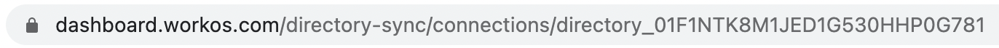

# python-django-directory-sync-example
A basic Django app that uses the [WorkOS Python SDK](https://github.com/workos-inc/workos-python) to support Directory Sync.

## Prerequisites
- Python 3.6+

## Directory Sync Setup with WorkOS
First, follow the [Create a New Directory Connection](https://workos.com/docs/directory-sync/guide/create-new-directory-connection) step in the WorkOS Directory Sync guide.

If you get stuck, please reach out to us at support@workos.com so we can help.

## Django Project Setup

### Clone Directory

1. In your CLI, navigate to the directory into which you want to clone this git repo.
   ```bash
   $ cd ~/Desktop/
   ```

2. Clone this git repo using your preferred secure method (HTTPS or SSH).
   ```bash
   # HTTPS
   $ git clone https://github.com/erin-workos/python-django-directory-sync-example.git
   ```

   or

   ```bash
   # SSH
   $ git clone git@github.com:erin-workos/python-django-directory-sync-example.git
   ```

### Install Dependencies

3. Navigate to the cloned repo.
   ```bash
   $ cd python-django-directory-sync-example
   ```

4. Create and source a Python virtual environment. You should then see `(env)` at the beginning of your command-line prompt.
   ```bash
   $ python3 -m venv env
   $ source env/bin/activate
   (env) $
   ```

5. Install the cloned app's dependencies.
   ```bash
   (env) $ pip install -r requirements.txt
   ```

### Set Environment Variables

6. Obtain and make note of the following values. In the next step, these will be set as environment variables.
   - Your [WorkOS API key](https://dashboard.workos.com/api-keys)
   - Your `DIRECTORY_ID`, retrievable from the URL in the Directory Sync area of the WorkOS dashboard:
      

7. Ensure you're in the root directory for the example app, `python-django-directory-sync-example/`. Create a `.env` file to securely store the environment variables. Open this file with the Nano text editor. (This file is listed in this repo's `.gitignore` file, so your sensitive information will not be checked into version control.)
   ```bash
   (env) $ touch .env
   (env) $ nano .env
   ```

8. Once the Nano text editor opens, you can directly edit the `.env` file by listing the environment variables:
   ```bash
   export WORKOS_API_KEY=<value found in step 6>
   export DIRECTORY_ID=<value found in step 6>
   ```

   To exit the Nano text editor, type `CTRL + x`. When prompted to "Save modified buffer", type `Y`, then press the `Enter` or `Return` key.

9. Source the environment variables so they are accessible to the operating system.
   ```bash
   (env) $ source .env
   ```

   You can ensure the environment variables were set correctly by running the following commands. The output should match the corresponding values.
   ```bash
   (env) $ echo $WORKOS_API_KEY
   (env) $ echo $DIRECTORY_ID
   ```

### Run Django Migrations and Start Server

10. Run the Django migrations. Again, ensure you're in the `python-django-directory-sync-example/` directory where the `manange.py` file is.
  ```bash
  (env) $ python3 manage.py migrate
  ```

  You should see output like:
  ```bash
  Operations to perform:
  Apply all migrations: admin, auth, contenttypes, sessions
  Running migrations:
  Applying contenttypes.0001_initial... OK
  Applying auth.0001_initial... OK
  . . .
  ```

11. Start the server.
  ```bash
  (env) $ python3 manage.py runserver
  ```

  You'll know the server is running when you see no errors in the CLI, and output similar to the following is displayed:

  ```bash
  Watching for file changes with StatReloader
  Performing system checks...

  System check identified no issues (0 silenced).
  March 18, 2021 - 04:54:50
  Django version 3.1.7, using settings 'workos_django.settings'
  Starting development server at http://127.0.0.1:8000/
  Quit the server with CONTROL-C.
  ```

12. Once the server is running, navigate to http://localhost:8000 and try out Directory Sync!

## Need help?

When you clone this repo, the `DEBUG` setting is `False` by default in `workos_django/settings.py`. You can set `DEBUG=True` if you need to troubleshoot something during the tutorial, but you must use `DEBUG=False` in order to successfully connect to the WorkOS API.

If you get stuck and aren't able to resolve the issue by reading our API reference or tutorials, please  reach out to us at support@workos.com and we'll help you out.
